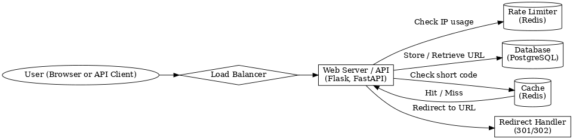

# 📄 URL Shortener - Requirements Report

## 🧠 Project Summary

Build a service that allows users to submit a long URL and receive a shorter, unique URL which can be used to redirect users to the original address. Similar to services like Bitly or TinyURL.

---

## ✅ Functional Requirements

### 1. Shorten URL
- Users can submit a valid URL via a form or API.
- The service returns a short URL (e.g., `https://short.ly/abc123`).
- Each long URL gets a unique short code.

### 2. Redirect
- When a short URL is accessed, the service looks up the corresponding long URL.
- It issues a 301/302 redirect to the original address.

### 3. Handle Duplicates
- Option 1: Always generate a new short code for duplicate URLs.
- Option 2 (optional): Reuse the same short code for repeated submissions of the same long URL.

### 4. Expiration (Optional)
- URLs can optionally expire after a set time or date.
- Expired short links should return a 404 or "expired" message.

### 5. Rate Limiting
- Users are limited in how many URLs they can shorten per hour (e.g., 100/hour).
- Rate limits are enforced via IP address, since no account system is used.

### 6. Analytics (Optional Future Feature)
- Count how many times each short URL is accessed.
- Track access time, referring URL, or user agent.

---

## 🧰 Technical Requirements

### Short Code Generation

**Strategy: Incremental ID + Base62 Encoding**
- Assign each URL a unique numeric ID.
- Convert that ID to a short alphanumeric string using Base62 (0–9, A–Z, a–z).
- Guarantees uniqueness, is compact, and easy to decode.

### Data Storage

**Schema Example:**

```sql
CREATE TABLE urls (
  id SERIAL PRIMARY KEY,
  short_code VARCHAR(10) UNIQUE NOT NULL,
  original_url TEXT NOT NULL,
  created_at TIMESTAMP NOT NULL DEFAULT CURRENT_TIMESTAMP,
  expires_at TIMESTAMP NULL
);
```

### Cache (Redis)
- Cache short_code → original_url mappings.
- Use Redis with TTL for eviction.
- Improves redirect speed and reduces DB load.

### Rate Limiting (via IP)
- Use Redis to track request counts by IP:
  - Key: `rate_limit:<IP>`
  - Expiry resets every hour.
- Deny or throttle requests exceeding limit.

---

## ⚙️ API Endpoints (Sample)

### POST `/shorten`

```json
Request:
{
  "url": "https://example.com/long/path"
}

Response:
{
  "short_url": "https://short.ly/abc123"
}
```

### GET `/:short_code`

- Redirects to the full URL or returns 404 if invalid/expired.

---

## 🛡️ Security & Reliability

- Validate input URLs to prevent XSS or injection.
- Use HTTPS to protect data in transit.
- Prevent short code guessing attacks.
- Monitor and throttle abuse via IP-based rate limiting.

---

## 📈 Scalability Considerations

- Use a load balancer for high traffic.
- Use Redis to cache frequently accessed URLs.
- Shard the DB or use horizontal scaling if needed.
- Use CDN to cache popular short codes near users.

---

## 🧪 Testing

- Unit tests for short code generation and redirect logic.
- Integration tests for API endpoints.
- Load testing for rate limits and performance.

---

## 💻 Tech Stack (Example)

| Component        | Technology        |
|------------------|------------------|
| Backend          | Python (Flask / FastAPI) |
| Database         | PostgreSQL       |
| Caching / Rate Limiting | Redis         |
| Deployment       | Docker + Nginx   |
| Domain           | `https://short.ly` |

---

## 📊 Architecture Diagram


